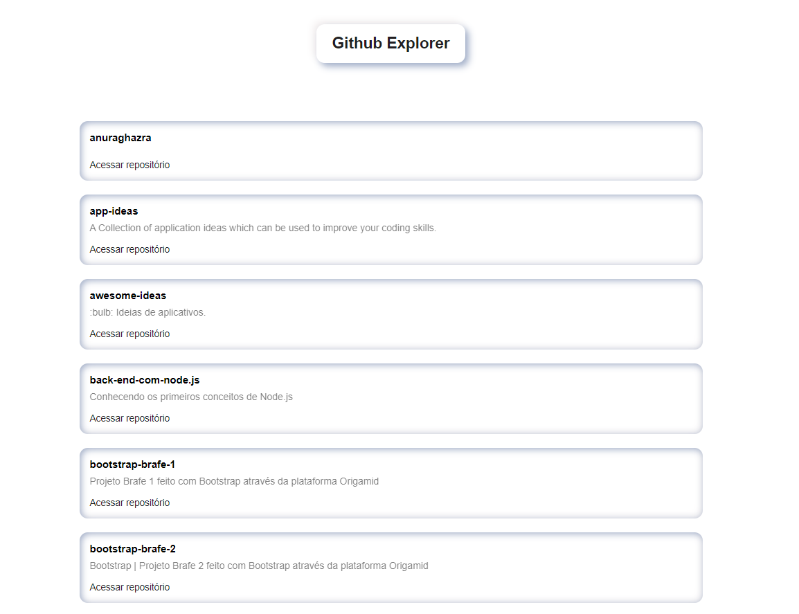

<h4 align="center">
  
</h4>

 <div align="center">
    <!-- LICENSE -->
    
    <!-- LAST COMMIT -->
    <a href="https://github.com/marcelo-rafael/ignite-reactjs-github-explorer/commits/master">
    
    </a>
    <!-- STARS -->
    <a href="https://github.com/marcelo-rafael/ignite-reactjs-github-explorer/stargazers/master">
    
    </a>
    <!-- FORKS -->
    <a href="https://github.com/marcelo-rafael/ignite-reactjs-github-explorer/forks/master">
    
    </a>
    <!-- AUTHOR -->
    
    <!-- LANGUAGES -->
    
    <!-- REPO SIZE -->
    
    <!-- CONTRIBUTORS -->
  
</div>

---

<h1 align="center">
Github Explorer - Ignite - Trilha React.js
</h1>
<p align="center">Deployed <a href="https://ignite-reactjs-github-explorer.vercel.app/">here</a>.</p>

---

## :computer: About

Github Explorer is a web application that lists all user repositories. project developed in the first chapter of Bootcamp Ignite - React.js

---

## 🚀 What is the [Ignite](https://rocketseat.com.br/ignite)?

Program to accelerate your career as a Dev..
Created to prepare you for the market, developing technical and behavioral skills. Evolve and certify in Elixir, Flutter, React.js or React Native.

---
<!-- 
#### 📋 Functionalities

  - [x] Sessão de home
  - [x] Sessão sobre
  - [x] Sessão de serviços
  - [x] Sessão de depoimentos
  - [x] Sessão de contacto
  - [x] Botão de agendamento para o WhatsApp.
  - [x] Ícones das redes sociais.
 
--- -->


<!-- #### 🎨 Layout

O layout da aplicação está disponível no Figma:

<a href="https://www.figma.com/file/x2gNYqpuVmCZacAoPEeiuv/Origin-Six-(Copy)?node-id=0%3A1">
  
</a>

Design feito por [Rebecca Gonzalez](https://dribbble.com/rebeccagonzalez)

--- -->

## :computer:  Web/mobile

<h4 align="center">
  
</h4>

<!-- #### 📱 Mobile

<h4 align="center">
  
  <p align="center">Tela inicial - OriginSix<p>
</h4>
--- -->

<!-- #### :crossed_swords: Desafios para melhorar a aplicação
- [ ] Criar documentação
    - [ ] Gif de exemplo
    - [x] Readme-me incrível
    - [x] Tecnologias usadas
    - [x] Setup do projeto
    - [x] Funcionalidades
    - [ ] Screenshot das páginas
    - [ ] Adicionar favicon
 - [ ] Melhorar estilos
    - [ ] breakpoints - adaptar para outros dispositivos
    - [ ] Mobile First
    - [ ] Trocar cores, fontes e conteúdo
 -->

---

## :rocket: Tech Stack

The following tools were used in the construction of the project:

- **[React](https://pt-br.reactjs.org/)**
- **[TypeScript](https://www.typescriptlang.org/)**
- **[Styled-Components](https://styled-components.com/)**

---

## 🚀 How to run the project

### Prerequisites

Have an editor to work with the code like [VSCode](https://code.visualstudio.com/)

---

## 👯 Cloning the repository

```bash
# Clone this repository
$ git clone https://github.com/marcelo-rafael/ignite-reacts-github-explorer


# Access the project folder in the terminal/cmd
$ cd oignite-reacts-github-explorer

```

### Running the Application

```bash
# install dependencies
$ yarn or npm install

# Run Application in Development
$ yarn dev or npm run start

# The application will open at port: 3000 - access http://localhost:3000
```

---

## 💪 How to contribute to the project
	  
1. 🍴 Fork the project.
2. 👯 Clone this repository to your machine.
3. 🎋 Create a new branch with your changes: `git checkout -b my-feature`
4. ✅ Save the changes and create a commit message telling you what you've done: `git commit -m "feature: My new feature"`
5. 📌 Submit your changes: `git push origin my-feature`
6. 🔃 Create a new pull request


Once your pull request has been merged, you can delete `your-feature`

> If you have any questions, check out this [GitHub Contribution Guide](https://github.com/firstcontributions/first-contributions)


---

## 🤓 Autor


<div>
<a href="mailto:marcelo.rafael.goncalves@gmail.com">
      
   </a>
<a href="https://www.linkedin.com/in/marcelo-rafael-gonçalves/">
      
   </a>
<a href="https://github.com/marcelo-rafael">
  
  </a>
</div>

---
	  
## 📝 LICENSE

This repository is licensed under the **MIT LICENSE**. For more detailed information, read the [LICENSE](./LICENSE) file contained in this repository.

<h3 align="center">
Made with ❤️ by <a href="https://www.linkedin.com/in/marcelo-rafael-goncalves/">Marcelo Rafael Gonçalves 💜🚀</a>
</h3>
	 
